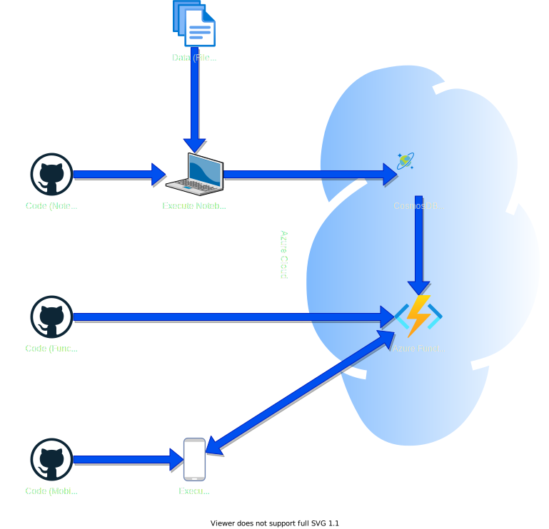
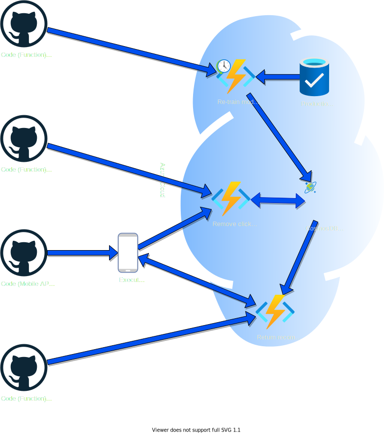

<!-- _class:  lead -->

# My Content

## Books Recommendation Mobile App

---

### Challenge

**My Content** is a start-up company that wants to _help people read more_ by recommending books that they will love 😍.

To overcome this challenge, we need to :

- represent books and users by _meaningful features_
- understand _users book preferences_
- recommend **the right books to the right users**

---

### Goals

In this project, we are going to :

- **define** the _meaningful features_ of books and users
- **compare** different _recommendation systems_
- **integrate** the best recommendation system with a _mobile application_

---

### Recommender Systems assumptions

- **similar users** are likely to have _similar content interrests_
- **similar contents** are likely to _interest users similarly_
- user's content **preferences** may be :
  - **explicit** : based on actual _feedback_ from users (reaction, rating, comment, ...)
  - **implicit** : based on the user's _behavior_ (clicks, views, time spent, purchase, ...)

---

### State of the art

There are three main categories of recommender systems :

- **Content-Based Filtering** : based solely on _content features_ and the user's _preferences_
  - find content _similar to what the user likes_
- **Collaborative Filtering** : based solely on the user's _preferences_ and the _user profiles_
  - find content that _similar users like_
- **Hybrid recommender systems** : _combination_ of content and collaborative filtering

---

### Exploratory data analysis (EDA)

For this MVP, we used the [Globo.com dataset](https://www.kaggle.com/datasets/gspmoreira/news-portal-user-interactions-by-globocom "Globo.com dataset") :

- **364047 articles** described by :
  - **3** _metadata_ fields (category, creation time and word count)
  - **250** dimensions embedding of the article's _content_
- **2988181 clicks** (from Oct. 1st to Oct. 17th , 2017)
  - on **46033** news _articles_
  - by **322897** _users_
  - described by **10** _fields_ (session, device and location)

---

### User preferences modeling

Without an explicit rating of the articles by the users, we must model an **implicit rating** : $Rating (user, article) = \frac{\#Clicks(user, article)}{\#Clicks(user)}$

As for a user's **preferences**, we tested 3 models :

- **last** clicked article
- _average_ of user's clicked articles over **last session**
- _average_ of **all** clicked articles

---

### Models

- Content-based Filtering : **Cosine Similarity** between user preferences and articles
- Collaborative Filtering
  - [Surprise library](https://surprise.readthedocs.io/ "Surprise library")
    - [BaslineOnly](https://surprise.readthedocs.io/en/stable/basic_algorithms.html#surprise.prediction_algorithms.baseline_only.BaselineOnly= "BaselineOnly") : just estmate user and articles _biases_
    - [SVD](https://surprise.readthedocs.io/en/stable/basic_algorithms.html#surprise.prediction_algorithms.baseline_only.BaselineOnly= "Singular Value Decomposition") : a simple _matrix factorisation_ technique
  - [Implicit library](https://implicit.readthedocs.io/ "Implicit library") : [ALS](https://implicit.readthedocs.io/en/latest/als.html "Alternating Least Squares") a more performant _MF_ technique
- Hybrid model
  - [LightFM library](https://lightfm.readthedocs.io/ "LightFM library") : uses MF technique on _latent features_

---

### Protocol

To evaluate our models, we left out the **last click of each user**.

We train our models on the _remaining clicks_.
We then predict _recommendations_ (ranking of all articles) for the next article the user will click.

Our model **score** is the _average **predicted rank** of the actual article_ the user has clicked last.

---

### Results

|   **Type**    | **Library**  |                  **Model/Algo**                   | **Mean Rank (lower is better)** | **Predict time (s)** |
| :-----------: | :----------: | :-----------------------------------------------: | :--------------------------------: | :------------------: |
| Content-based | scikit-learn |  **cosine similarity** with mean of _last click_  |                264                 |          17          |
| Content-based | scikit-learn | **cosine similarity** with mean of _last session_ |                252                 |          17          |
| Content-based | scikit-learn |  **cosine similarity** with mean of _all clicks_  |                216                 |          17          |
| Collaborative |   Surprise   |                 **BaselineOnly**                  |                5972                |         1.68         |
| Collaborative |   Surprise   |                      **SVD**                      |               51874                |         1.85         |
| Collaborative |   Implicit   |            **AlternatingLeastSquares**            |                3.83                |         0.05         |
|    Hybrid     |   LightFM    |                    **LightFM**                    |                228                 |         0.17         |

---

### Curent MVP System Architecture

---

### Demo

- Start [Azure CosmosDB](https://portal.azure.com/#@clementfleurypm.onmicrosoft.com/resource/subscriptions/da2e4791-6dd1-422b-848a-a961cef6ab89/resourceGroups/OC_P9/providers/Microsoft.DocumentDb/databaseAccounts/oc-p9-cosmosdb/overview "Azure CosmosDB")
- Start [Azure Function](https://portal.azure.com/#@clementfleurypm.onmicrosoft.com/resource/subscriptions/da2e4791-6dd1-422b-848a-a961cef6ab89/resourceGroups/ocp9functionsgetrecommen/providers/Microsoft.Web/sites/oc-p9-functions-GetRecommendations/appServices "Azure Function")
- Launch App in emulator

---

### Target Production System Architecture

---

### Next steps

- Test the recommender system on **real data**
- **Fine-tune** the model's hyper parameters
- Implement the **taret production system architecture**
- **Improve the Mobile App** (UX, security, ...)

---

<!-- _class:  lead -->

